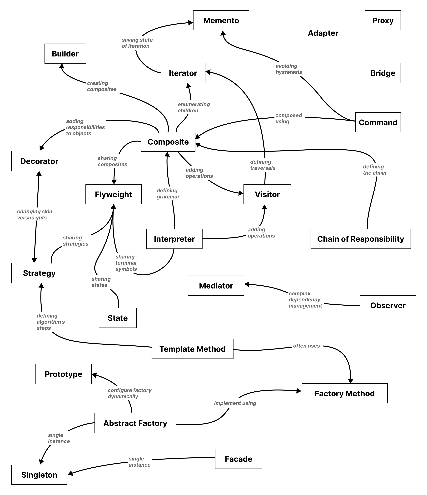

# Design Patterns in TypeScript

## All of the 23 "Gang of Four" Design Patterns, exemplified

Similar to my other "5 Minutes of Less" repositories, the rationale is to demonstrate and explain, with minimal means, things that many of us developers seem to think are hard. By driving down the difficulty and concretely showing examples, I hope to make these concepts easier to understand and learn more about.

## Five Minutes or Less

- [SOLID](https://github.com/mikaelvesavuori/5-minutes-or-less-solid)
- [TypeScript/JavaScript patterns and features](https://github.com/mikaelvesavuori/5-minutes-or-less-typescript-js)

## Running the code

Clone the repo.

You can install the dependencies with `npm install` and then just go at each file with `npx ts-node src/{type}/{filename}.ts`.

Or, if you're lazy, you can also copy the individual TS file's contents into the [TypeScript playground](https://www.typescriptlang.org/play) if you want to avoid cloning and installing anything at all.

---

## Why design patterns?

In short, patterns are ways of organizing code that are identified and (often) catalogued. Typically, patterns, once named become known in the software community. Many patterns have existed for a very long time, and patterns are less fragile to the course of time than implementations and languages, which change year by year, decade by decade.

No one can work outside of patterns — ultimately all code has some pattern(s) in it.

Design Patterns are part of the software engineering canon, and are useful bits of practical knowledge that help in "blocking out" solution spaces for problems. Applying them haphazardly, clumsily, and without thinking about the specifics of our problem space will not lead to good use of these.

In programming, few problems are truly novel. That's an important part of understanding design patterns, whether they are (actual) architectural design patterns (like those of Christopher Alexander) or software design patterns, such as these.

Competent and thoughtful use of these patterns in our work helps organize and solve our problems in ways that can solve any number of similar problems, at least in theory, and if we have matched problem and pattern adequately.

With this said, design patterns are always constructs that must be applied. Patterns won't _directly_ solve your programming woes.

## The value of examples

If you're like me, and if you read _[Design Patterns: Elements of Reusable Object-Oriented Software](https://www.goodreads.com/book/show/85009.Design_Patterns)_, you may agree that it's a bit of a tough book to swallow.

Some of the obvious hard parts of it include:

- The book lists 23 different patterns. While they all follow a common, sound convention it's more of reference book rather than something you read in one go.
- The book is ~30 years old, and the examples are therefore using C++ and SmallTalk. I know that _I_ am not a C++ guy, and SmallTalk is pretty dead by now.
- Also, the diagrams weren't even UML (as that didn't exist at the time), and these diagrams are generally, for many, somewhat obtuse to follow.

I'm not here to dismiss the book — quite the contrary! It's a classic and especially the sections on each pattern's applicability and consequences are great and well worth reading.

Clearly, the patterns have survived to this day. But it's time to look at, learn, and fiddle with the examples in a language that suits you. For me, that's TypeScript/JavaScript.

I also believe that with concrete examples, senior developers will already be able to intuit many trade-offs of each pattern.

Please see the referenced resources below when you are ready to dive deeper!

## The format of the examples

All patterns are organized the same way as in the book _Design Patterns_. All patterns include a description, and start with its intent quoted from the book.

The flow is: `Creational patterns` > `Structural patterns` > `Behavioral patterns`.

## Design aspects

> _Consider what should be variable in your design_. This approach is the opposite of focusing on the causes of redesign. Instead of considering what might _force_ a change to a design, consider what you want to be _able_ to change without redesign. The focus here is on _encapsulating the concept that varies_, a theme of many design patterns. [The table below] lists the design aspect(s) that design patterns let you vary independently, thereby letting you change them without redesign.
— _"Design Patterns: Elements of Reusable Object-Oriented Software"_, page 29

| Purpose    | Design Pattern   | Aspect(s) That Can Vary                                                                    |
| ---------- | ---------------- | ------------------------------------------------------------------------------------------ |
| Creational | [Abstract Factory](/src/creational/abstract-factory.ts) | families of product objects                                                                |
|            | [Builder](/src/creational/builder.ts)          | how a composite object gets created                                                        |
|            | [Factory Method](/src/creational/factory.ts)   | subclass of object that is instantiated                                                    |
|            | [Prototype](/src/creational/prototype.ts)        | class of object that is instantiated                                                       |
|            | [Singleton](/src/creational/singleton.ts)        | the sole instance of a class                                                               |
| Structural | [Adapter](/src/structural/adapter.ts)          | interface to an object                                                                     |
|            | [Bridge](/src/structural/bridge.ts)           | implementation of an object                                                                |
|            | [Composite](/src/structural/composite.ts)        | structure and composition of an object                                                     |
|            | [Decorator](/src/structural/decorator.ts)        | responsibilities of an object without subclassing                                          |
|            | [Facade](/src/structural/facade.ts)           | interface to a subsystem                                                                   |
|            | [Flyweight](/src/structural/flyweight.ts)        | storage costs of objects                                                                   |
|            | [Proxy](/src/structural/proxy.ts)            | how an object is accessed; its location                                                    |
| Behavioral | [Chain of Responsibility](/src/behavioral/chain-of-responsibility.ts)  | object that can fulfill a request                                                  |
|            | [Command](/src/behavioral/command.ts)          | when and how a request is fulfilled                                                        |
|            | [Interpreter](/src/behavioral/interpreter.ts)      | grammar and interpretation of a language                                                   |
|            | [Iterator](/src/behavioral/iterator.ts)         | how an aggregate's elements are accessed, traversed                                        |
|            | [Mediator](/src/behavioral/mediator.ts)         | how and which objects interact with each other                                             |
|            | [Memento](/src/behavioral/memento.ts)          | what private information is stored outside an object, and when                             |
|            | [Observer](/src/behavioral/observer.ts)         | number of objects that depend on another object; how the dependent objects stay up to date |
|            | [State](/src/behavioral/state.ts)            | states of an object                                                                        |
|            | [Strategy](/src/behavioral/strategy.ts)         | an algorithm                                                                               |
|            | [Template Method](/src/behavioral/template-method.ts)  | steps of an algorithm                                                                      |
|            | [Visitor](src/behavioral/visitor.ts)          | operations that can be applied to object(s) without changing their class(es)               |

## Design pattern relationships

This useful diagram is in the Design Patterns book. I've redrawn it here, as it's helpful in organizing the relations of patterns.



## Where to start?

The authors have their own set of recommendations:

```md
If you aren't an experienced object-oriented designer, then start with the simplest and most common patterns:

- Abstract Factory
- Adapter
- Composite
- Factory Method
- Observer
- Strategy
- Template Method
- Decorator
```

My own top 5 recommendations (A-Z order), in terms of usefulness and relative ease, would be:

- [Facade](/src/structural/facade.ts)
- [Factory](/src/creational/factory.ts)
- [Mediator](/src/behavioral/mediator.ts)
- [Strategy](/src/behavioral/strategy.ts)
- [Template Method](/src/behavioral/template-method.ts)

## Transparency

For transparency, I've used and adapted ChatGPT 3.5 examples of these patterns. Explanations are mine, and the adaptation of code is done to an extent where I feel it looks like "my code" and what I would write and show.

Everything is cross-checked with the book to validate correctness.

## Resources

- [Design Patterns: Elements of Reusable Object-Oriented Software](https://www.goodreads.com/book/show/85009.Design_Patterns)
- [Design Patterns on Refactoring.guru](https://refactoring.guru/design-patterns)
- [Dive Into Design Patterns](https://refactoring.guru/design-patterns/book)
